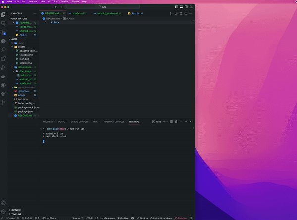

# Xcode

Xcode is only available on macOS. Windows and Linux users should use Android Studio.

## Installing Xcode

If you want fuller details on installing Xcode, you can read this article: [The Best and Fastest Ways to Install Xcode on your Mac](https://matteomanferdini.com/install-xcode/).

### Installing Xcode from the Mac App Store

The easiest and longest way to install Xcode is through the Mac App Store. It can take ages and feel like it is stuck, but it will eventually finish... usually... eventually. I was sure mine had crashed but after half an hour of seeming to do nothing it finished.

Unless you are using the latest Mac OS, the App Store may offer to install the latest version of Xcode that is compatible with your OS. This is fine.

### Installing Xcode from the Apple Developer website

On my 2010 MacBook Pro, the App Store would not install Xcode. I had to download it from the Apple Developer website. You will need to sign in with your Apple ID to download it.

All Xcode versions are available from the [Apple Developer website](https://developer.apple.com/download/all/). You will need to sign in with your Apple ID to download it.

Wikipedia has a page of slightly dubious information that will give you an idea of which version of Xcode you need for your version of macOS: [Xcode - Wikipedia](https://en.wikipedia.org/wiki/Xcode#Versions).

Whenever I have done this, I have downloaded a xip file that I have had to extract. I then had to move the extracted Xcode app to the Applications folder. There is a StackOverflow question that explains this [here](https://stackoverflow.com/questions/43663097/how-to-install-xcode-from-xip-file).

### Installing Xcode Command Line Tools

This seems to be the quickest and most complex way to install Xcode. I have never done it but there is a ton of information on the web about it if it is your preferred method, including in the article at the top of this page.

## Issues to be aware of

Please add to this with any issues that you think others may need to be aware of.

- Even with Xcode installed via the App Store, I have received an error message when running `npx run ios` telling me I need to install Xcode and linking to the App Store. After going round in circles for a while, I found that running `sudo xcode-select -s /Applications/Xcode.app/Contents/Developer` fixed the problem.

- Having installed Xcode from the [Apple Developer website](https://developer.apple.com/download/all/) as detailed above, when running `npx run ios` I received an error message telling me I needed Xcode v. 14.1 mimimum. I had installed version 14.0.1 as referenced by a different Wikipedia page from the one linked above. I found that Xcode v.14.2 runs fine on Monterey (12.6.2) and then it worked fine.

- Opening the Aura app with automatic opening of the iOS Simulator worked seemlessly on a 2014 MacBook Air but opening the simulator for the first time took around 4 mins! This clearly involved a lot of downloading and initialising. Subsequent openings were much quicker, around 17 seconds which still feels like a long time.

- I have read that you need to have a version of Xcode Command Line Tools selected in Xcode Settings and none is selected by default. This was not the case for me but you might want to check by opening Xcode (no need to open a project) and go to Settings > Locations and check that a version of Xcode Command Line Tools is selected.

## Using the Xcode iOS Simulator with Aura

This is all new to me so I can only tell of my experience so far as a complete beginner. I found the behaviour of starting a React Native app for iOS can be sketchy but seems to work most of the time. The first time I started the Aura app, it crashed, then without changing anything, it worked and automatically opened the iOS Simulator. The third time I tried it, it produced a QR code for use with a physical iPhone AND also opened the iOS Simulator. I have had no problems since.

Xcode does not need to be open for the iOS Simulator to work, just installed.

## Using the Xcode iOS Simulator with Expo

You can install the [Expo Go app](https://expo.dev/client) on your phone from the App Store. It is also available for Android from the Google Play Store for use with Android Studio.

My experience with the Expo Go app on my iPhone has been pretty seemless.

Running `npx expo start` produces a QR code that can be scanned with the Expo Go app. The app then loads the app and runs it. It is very quick and easy but I have found that running `npx run ios` also produces the same QR code and opens the iOS Simulator at the same time.

Scanning the QR code with the Expo Go app on my iPhone to open the Aura app on my iPhone.

